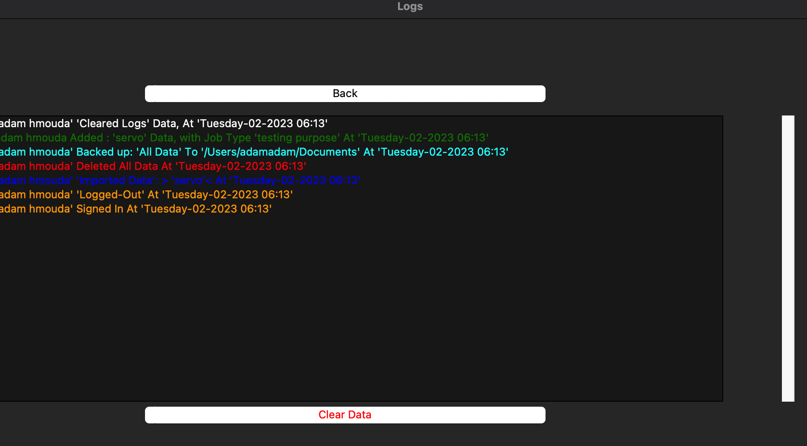

# Data Management System

This is a data management system developed using Python and the tkinter library. It is designed to help users store and manage their data in an efficient and organized manner.

## Features
- Login and registration system
- Different levels of access for users and admins
- User management system for admins to create and modify user accounts
- Data backup and restore options
- Logs system to track all user activities and modifications made to the data
- Ability to clear all data in the system

## Installation
To use this data management system, you will need to have Python 3 and the tkinter library installed on your computer. 

You can download Python 3 from the official Python website: https://www.python.org/downloads/

To install tkinter, you can use pip by running the following command in your terminal or command prompt:

```
pip install tkinter
```

## Getting Started
To run the data management system, simply run the `main.py` file. You will be prompted to login , for the verry first time you login use these credentials :
```
User name : adam
Password : lzqxwtq
```
Once logged in, you will be presented with a dashboard where you can create, view, and manage your data in the Data Manager Tab. Admins will have additional options to manage user accounts and view logs of user activities.


After that , make sure to create your own account in the : `User Management` --> `Add/Delete User` and set yourself as admin and procced to log out and login with the new user.

## Usage
The data management system provides a simple and intuitive interface for users to manage their data. The following are some basic instructions on how to use the system:

### Adding Data
To add new data, Navigate to the Data Manager tab, You will be prompted to enter the data you want to add. Once you have entered the data, click on the `Add` button to save it to the system.


### Viewing Data
There are Two ways to view the data the easiest one is To click on the "Manage All Data" button on the dashboard. You will be presented with a list of all the data you have added to the system, click on any to view its content, the oher methode is by using the search Button. To use the search button you can type either the: `Business Name`, `Name`, `Email` or `Phone Number` of the data that you already saved and click Search


### Modifying Data
To modify existing data, simply rewrite the already existing data and make the necessary changes for example by modifying the Business Name, Name, Email or Phone Number or any other data

### Deleting Data
To delete existing data, click on the `Manage All Data` button on the dashboard. You will be prompted to select the data you want to delete from a list of all your data. Once you have selected the data, click on the `Delete Selected Data` button to remove it from the system or `Delete ALl Data` Button to Delete everything, another way is to use the `Delete` Button from the Data Manager Dashboard by simply entering the "Business Name" and click Delete.

### Backing Up Data
To back up your data, click on the `Backup Selected Data` or the `Backup All Data` buttons inside the `Manage All Data` TAb. You will be prompted to select a location to save the backup file. 

### Restoring Data
To restore your data, click on the `View/Import Data` button on the dashboard. You will be prompted to select the backup file you want to restore from. You can also View the contents of the files once they are Imported and used with the `Search` Button

### User Management
`Admins` can manage user accounts by clicking on the `User Management` button on the dashboard. From here, they can create and modify user accounts, as well as viewing existing Users using the `Show User` Button.


This menu appear when you select `Show User`:


### Users Permesions
```
Admins : Full Access over everything.
User : Can Only View/Read Data.
Moderator : Can Save/View/Delete/Backup and Restore Data. (Excluding User Management and Logs)
```
### Deleting Users
In the `USer Management` Tab navigate to `Add/Delete User` and enter the user name(`Full Name entry`) and click `Delete`

### Logs
To view logs of user activities, click on the `Logs` button on the dashboard, `only Admins can access this tab`. Here you can view a list of all user activities and modifications made to the data in specific colors.



### Clearing Logs
To clear all Logs in the system, click on the `Clear Data` button on the dashboard. You will be prompted to enter a password to confirm the action.The Password is :
```
master
```

## Credits
This data management system was developed by `Adam Hmouda` as a project for my friend Company.

`Contact : adamhamouda24@gmail.com`

## License

You may edit this code as you see fit for your personal use but you may not sell it.


## Code Descriptions and usage
In this section i will provide what each Important function does

```python
def random_log():
```
The `random_log()` function generates a random integer between 1 and 9,000,000 using the `random.randint()` function from the built-in `random` module in Python. 

The function then stores this generated integer in a global variable `a`, which can be accessed and modified from anywhere in the program. 

```python
def create_user_file():
```
The `create_user_file()` function creates a JSON file called "user.json" if it doesn't already exist in the current working directory. If the file exists or is created, the function then loads its contents into a Python dictionary using the `json.load()` function. 

The function then searches the dictionary for a user with a specific "Full Name" field that has a hardcoded value of "96be070791b7d545dc75084e59059d2170eed247350b351db5330fbd947e4be6". If such a user does not exist in the dictionary, the function adds a new user to the dictionary with the hardcoded "Full Name", a "User Type" of `Dummy`, and a hardcoded password.

After adding the new user to the dictionary, the function saves the updated dictionary to the `user.json` file using the `json.dump()` function, and then truncates the file to its current position using the `f.truncate()` method to avoid overwriting any extra data that may exist beyond the end of the updated JSON data.

```python
def create_json_files():
```
The `create_json_files()` function creates five JSON files with the filenames `data.json`, `email.json`, `job.json`, `name.json`, and `phone.json` in the current working directory if they do not already exist.

The function does this by first defining a list of filenames to create as `files_to_create`. It then iterates over each filename in the `files_to_create` list and checks if a file with that name already exists in the current working directory using the `os.path.exists()` function. 

If a file with the current filename does not exist, the function creates it using the `open()` function with the `w` mode to write to the file. The function then writes an empty dictionary to the file using the `json.dump()` function, effectively creating a new, empty JSON file.

```python
def listbox_used(event):
```
The `listbox_used()` function is an event handler function that is called when the user selects an item in a Tkinter listbox widget. The function takes an `event` argument, which is automatically passed by Tkinter when the event is triggered.

When the function is called, it first retrieves the currently selected item in the listbox using the `curselection()` method and the `get()` method. The selected item is then used as a key to access the corresponding data in a JSON file named `data.json`.

The function attempts to open "data.json" using a `with` statement and loads the JSON data into a dictionary named `data` using the `json.load()` function. The function then checks if the selected item exists in the `data` dictionary and if the user has the required permissions to view the data. The required permissions are checked using the boolean variables `admin_confirmed`, `user_confirmed`, and `moderator_confirmed`, which are assumed to be defined elsewhere in the program.

If the user has the required permissions and the selected item exists in the `data` dictionary, the function retrieves the corresponding business name, email, name, location, phone number, job type, and status values from the dictionary using the `get()` method. The function then displays a message box with the retrieved values using the `showinfo()` method and a formatted string.

If the user does not have the required permissions to view the data, the function displays an access denied warning message using the `showwarning()` method.

If the selected item does not exist in the `data` dictionary, the function displays a warning message indicating that no details for the selected item exist.

```python
def backup_file():
```
This function allows the user to back up the data of a selected item to a specified directory. 

It first checks if the user has the necessary permissions to perform this action by checking if the global variables `admin_confirmed` or `moderator_confirmed` are true. If either of these variables is true, the function proceeds with the backup process.

The function then prompts the user to select an item from the `listbox` widget. It uses the `get()` method of the `listbox` widget to get the selected item. 

Next, the function uses the `askdirectory()` method of the `filedialog` module to prompt the user to select a backup directory. If the user selects a directory, the function continues with the backup process.

The function then creates a new log entry that includes the current date and time, the name of the user who performed the backup, and the name of the item that was backed up, and appends this entry to the `logs.json` file.

If the selected item exists in the `data.json` file, the function creates a new dictionary that includes only the data for the selected item, and writes this data to a new file in the specified backup directory. The filename for the backup file is the name of the selected item, with a `txt` extension.

If the user does not have the necessary permissions to perform this action, the function displays a warning message to the user and returns.

```python
def delete_all():
```
The `delete_all()` function takes no arguments and deletes all data from the `data.json`, `email.json`, `job.json`, `name.json`, and `phone.json` files, as well as adding a log entry to the `logs.json` file. 

If the current user is an admin or moderator, the function opens a pop-up window asking the user to confirm the deletion by typing "delete" into an Entry widget. If the user confirms, the function overwrites each of the files with empty dictionaries, and adds a log entry to `logs.json`. If the user types anything else into the Entry widget, the widget is cleared and `Invalid input` is inserted into the Entry widget.

If the current user is not an admin or moderator, the function shows a warning message `Access Denied` and returns.

`Note`: This function permanently deletes all data and should be used with caution.

```python
def show_list():
```
This code defines a function called `show_list()`, which creates a new window to display a list of company data. The function also creates a listbox to display the companies and various buttons to backup, delete, or delete all the data.

The list of companies is retrieved from the "data.json" file, and each company is added to the listbox using a loop. The function also binds a function called `listbox_used()` to the `"<<ListboxSelect>>"` event, which will be called whenever an item in the listbox is selected.

```python
def save():
```
1. The function checks if the `admin_confirmed` or `moderator_confirmed` variables are set to `True`. If one of them is `True`, then the function proceeds to save the user data. Otherwise, it shows a warning message indicating that access is denied.

2. If access is granted, the function retrieves the user data from several tkinter entry widgets and a text widget.

3. The user data is organized into a dictionary called `new_data` that has several key-value pairs representing the user's business name, name, email, location, phone number, job type, and description.

4. The function creates four more dictionaries called `name_data`, `email_data`, `phone_data`, and `job_data`. These dictionaries have the same structure as `new_data`, but the keys are the user's name, email, phone number, and job type, respectively.

5. The function creates a new dictionary called `new_log` that has a single key-value pair representing a log message indicating that the user's data was added. The log message includes the user's business name, job type, and the date and time the data was added.

6. The function checks if any of the required fields are left empty. If so, it shows an error message indicating that the user needs to fill out all fields.

7. If all fields are filled out, the function tries to open several JSON files in read mode: `data.json`, `name.json`, `email.json`, `phone.json`, `job.json`, and `logs.json`. If any of these files does not exist, the function creates them and writes the new data to them.

8. If all JSON files exist, the function reads the existing data from them and updates it with the new data.

9. Finally, the function writes the updated data to the JSON files and clears the tkinter entry widgets and text widget.

```python
def save_new_user():
```

1. Get the full name and password of the new user from two tkinter Entry widgets named `full_name_entry` and `user_pass_entry`.
2. Hash the full name and password using SHA-256 encryption.
3. Create a new dictionary called `user_new` with the hashed full name, user type `y`, and hashed password as values, and the full name as the key.
4. Create a new dictionary called `new_log` with a log message that indicates that the current user `u` has added a new user with the specified full name, user type, and date and time.
5. If either the full name or password is empty, display an error message using a tkinter messagebox widget.
6. Try to open two JSON files named `user.json` and `logs.json` for reading.
7. If either file is not found, create new dictionaries called `data` and `data_logs` with the new user and log message, respectively.
8. If the full name of the new user already exists in the `data` dictionary, display an error message using a tkinter messagebox widget and call the `random_log()` function to create a random log message.
9. Otherwise, add the new user and log message dictionaries to the `data` and `data_logs` dictionaries, respectively.
10. Write the updated `data` and `data_logs` dictionaries to the `user.json` and `logs.json` files, respectively.
11. Delete the contents of the `full_name_entry` and `user_pass_entry` widgets.
12. Call the `random_log()` function to create a random log message.

```python
def find_data():
```

The `find_data()` function search for data in two different JSON files (`data.json` and `imports.json`) based on a provided business name (`bn`). 

If `bn` exists in `data.json`, the function extracts and displays the corresponding data fields (business name, email, name, location, phone number, job type, value) using `messagebox.showinfo()`. 

If `bn` does not exist in `data.json`, the function checks if `bn` exists in `imports.json` and the user is an admin, in which case it displays the corresponding data fields. If the user is not an admin or `bn` does not exist in `imports.json`, the function displays a warning message.

The function also clears the `bname_entry` widget and calls `random_log()` at the end.

```python
def delete():
```
This code deletes data from the JSON files. Here's how it works:

1. It gets the values of `bname_entry`, `name_entry`, `phone_entry`, `email_entry`, and `job_entry` and stores them in `bn`, `nm`, `ph`, `eml`, and `jb`, respectively.

2. If the user is an admin or moderator, a message box is shown asking for confirmation to delete the data. If the user confirms, the following actions are performed:
   - The `data.json`, `name.json`, `email.json`, `phone.json`, and `job.json` files are opened in read mode.
   - The JSON objects in each file are loaded into memory.
   - The data corresponding to the specified business name, name, phone, email, and job are deleted from each JSON object.
   - The updated JSON objects are written back to their respective files in write mode.
   - The values in `bname_entry`, `name_entry`, `phone_entry`, `email_entry`, and `job_entry` are deleted.

3. A new log entry is created with the information that the user deleted the data.

4. If the user is not an admin or moderator, a message box is shown informing them that access is denied.

```python
def sign_in():
```
This is a function handle user login functionality. 

The function begins by getting the values of the username and password entered by the user. It then sets some global variables to `False`, indicating that the user has not been confirmed as an admin, moderator or regular user.

The function then attempts to read the `user.json` file, which contains information about registered users. If the entered username matches a username in the file, the function checks if the entered password (hashed with SHA-256) matches the stored hashed password. If the passwords match, the function creates a new log entry for the successful login, and updates the `admin_confirmed`, `moderator_confirmed`, or `user_confirmed` global variables depending on the user type.

If the login is successful and the user type is "Admin", "Moderator" or "User", the function calls the `home_screen` function to display the main program window.

```python
def login_screen():
```
The code creates a graphical user interface (GUI) for a login screen. 

The function creates a `Tk` object for the login window, configures its title and padding, and creates a `Canvas` object with an image to display the logo of "Dripoli Web".

Then the function creates two `Label` objects for the username and password fields respectively, and two `Entry` objects for user input. The username entry widget is given focus with the `focus()` method.

The code also defines a nested function named `show_license_agreement()` that creates a new toplevel window to display a software license agreement.

```python
def log_out():
```

This is a function that logs a user out of the application. The function creates a new log entry that includes the username, date and time that the user logged out. It then opens the "logs.json" file and updates it with the new log entry. Finally, it clears the username and password fields and switches back to the login window.

```python
def import_data():
```
This function import data from a file, update the `imports.json` file, and display the imported data in a listbox. It also generates a log entry about the import event.

Here is a breakdown of the function:

1. First, it checks whether the user has sufficient privileges to import data. If not, it displays an error message.

2.  If the user has sufficient privileges, it prompts the user to select a file to import. The file types that can be selected are `txt` and `json`.

3. If the user cancels the file selection, the function returns without doing anything.

4.  If the user selects a file, the function attempts to read the file and load its contents as `JSON data`.

5. If the file is not in valid `JSON format`, the function displays an error message.

6. If the file is in valid `JSON format`, the function creates a new log entry about the data import event.

7. If the file is empty, the function displays a warning message and returns without doing anything.

8.  The function then updates the `imports.json` file with the new data.

9. It also updates the `logs.json` file with the new log entry.

10. It clears the contents of the import_listbox and repopulates it with the contents of the updated `imports.json` file.

11. Finally, it displays a message box indicating that the data import was successful.

```python
def imports_screen():
```
This function defines a graphical user interface for importing and managing data. It first checks whether the user has the necessary access to perform the operation. If the user has the required access, it creates a new window, hides the main window, and displays the import window. 

The import window consists of a canvas, a listbox to show imported data, and several buttons for managing data, including import data, show data content, delete selected data, delete all data, and go back. 

The function also checks if the `imports.json` file exists. If it doesn't exist, the function creates the file with an empty dictionary as the initial content. Then, it reads the content of the file, populates the listbox with the items in the file. 

The function binds the buttons to the appropriate functions for their respective actions, including importing data, showing data content, deleting selected data, deleting all data, and going back to the main window. 

If the user doesn't have the necessary access to perform the operation, the function displays an access denied warning message.

```python
def main_screen():
```
This code defines a GUI. The main function creates a top-level window and adds various widgets to it, including labels, entries, buttons, and a canvas for displaying an image. The code allows the user to add, delete, and search for data related to businesses, clients, and competitors. It also includes features for managing all data, importing data, and viewing descriptions.

```python
def home_screen():
```
This code provides the screen which will display if the login was successful.

```python
def delete_user():
```
This is a function that deletes a user from the system. It first gets the full name of the user to be deleted from the input entry, and then creates a log with the details of the user deletion. It then prompts the user to confirm the deletion and if confirmed, it opens the `user.json` and `logs.json` files, loads the data, deletes the user from the `user.json` file, updates the `logs.json` file with the new log entry and saves the changes. It then clears the input fields and displays a message informing the user that the deletion was successful.

If the user cancels the deletion, the input fields are cleared and the function ends without making any changes.

```python
def users_window_screen():
```
This function create a window to display a list of users stored in the `user.json` file. 

It creates a new Toplevel window, sets its title and padding, and creates a Canvas and a Listbox inside it. The scrollbar is also added to the Listbox to enable scrolling through the users. 

The function then reads the data from the `user.json` file and populates the Listbox with the names of the users stored in it. Finally, it starts the event loop using `mainloop()`. 

If `admin_confirmed` is not `True`, it displays a warning message saying `Access Denied`.

```python
def add_user_screen():
```
This code creates a new window where users can add or delete users from the system. 

The function first checks whether the user who opened the window is an admin. If not, it shows a warning message and doesn't create the window. If the user is an admin, it creates a new Toplevel window named `add_screen` with a title `Add/Delete User` and sets its padding.

The function then creates a Canvas widget in the new window with a height of 200 and width of 200, and places it at row 0, column 1.

Next, it creates two Labels with the text "Full Name:" and "Password:" and places them at row 0, column 0 and row 1, column 0 respectively.

Two Entry widgets are then created and placed at row 0, column 1 and row 1, column 1 respectively. The `full_name_entry` is also stored in a global variable.

Three Radiobuttons are created with the text `Admin`, `User`, and `Moderator`, and are placed at row 2, column 1, row 3, column 1, and row 4, column 1 respectively.

Three Buttons are then created: `Back`, `Add`, and `Delete`. The "Back" button has a width of 10 and calls the `add_user_back()` function when clicked. The `Add` button has a width of 15, is colored green, and calls the `save_new_user()` function when clicked. The `Delete` button has a width of 15, is colored red, and calls the `delete_user()` function when clicked.

Finally, the `add_screen` window is started and waits for events to be processed.

```python
def user_screen():
```
This code provides the screen which will display the Users Management Tabs if the logged in user is an Admin.

```python
def logs_screen():
```
This is a function for creating a logs screen. It first checks if the user accessing the screen is an admin, and if so, it creates a new Toplevel window called `logs`. It configures the window with padding and creates a canvas with a listbox widget for displaying logs.

There are two buttons, one for clearing the log data and one for going back to the home screen. The listbox widget is also configured with a vertical scrollbar.

The function reads from a JSON file called `logs.json` and populates the listbox with the log data. It then loops through each item in the listbox and changes the color based on the log message. If the message contains the word `deleted`, the text color is set to red. If the message contains the word `added`, the text color is set to green. If the message contains the words `signed in` or `logged-out`, the text color is set to orange. If the message contains the word `imported`, the text color is set to blue. If the message contains the words `backed up`, the text color is set to cyan.

Finally, the logs screen window is displayed using the mainloop() method. If the user accessing the screen is not an admin, a warning message is displayed using the messagebox.showwarning() method.

```python
def delete_logs_data():
```
This code defines a function `delete_logs_data()` that is called when the user clicks on the "Clear Data" button in the `logs_screen()` function. 

The function creates a new window `confirmation_window` that asks the user to enter a password to confirm the deletion of the logs. If the password entered matches the correct password, the function clears the data in the `logs.json` file and adds a new log to indicate that the logs were cleared. The function then destroys the `confirmation_window` and updates the list of logs in the `logs_listbox` widget.

If the password entered is incorrect, the function displays an error message using the `messagebox.showerror()` function.
